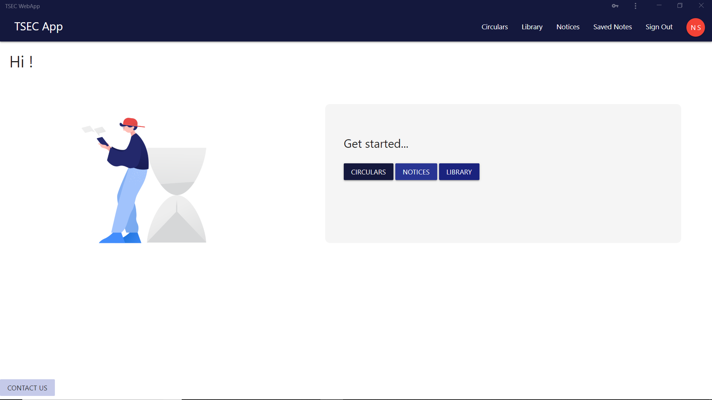
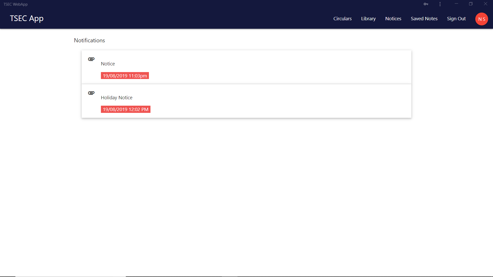
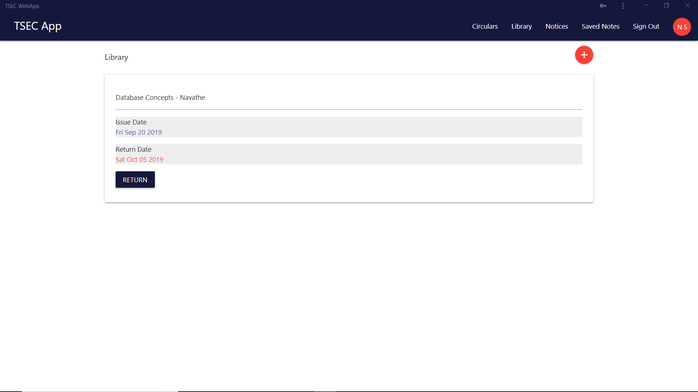
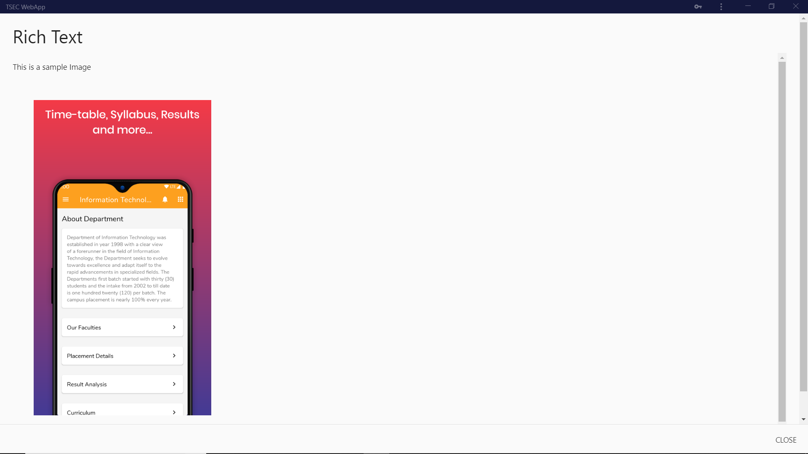
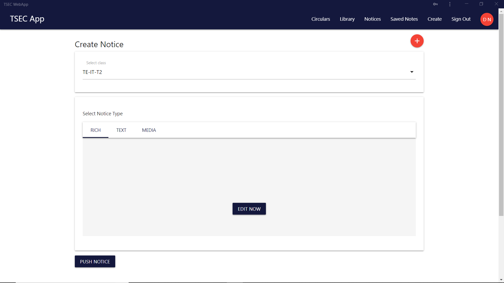
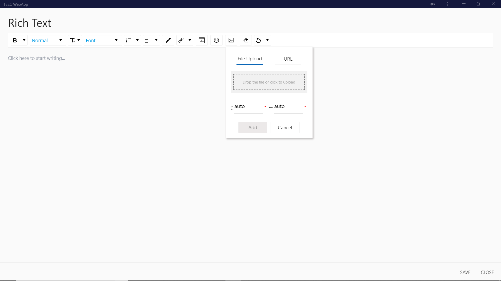
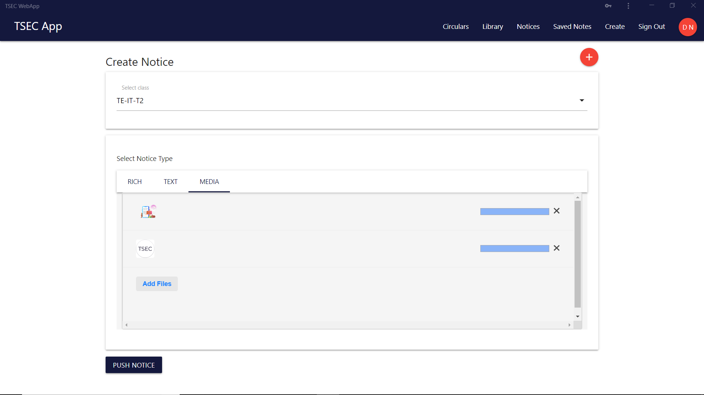

## Purpose
---

Sample deployment at [tsecwebapp.netlify.com](https://tsecwebapp.netlify.com) <br>
This is a web app for a school college to provide one way communication between college staff (read teachers, HODs, Principal...) and students.

### Sharing methods include
<li>Text
<li>Media
<li>Rich Text

### Credentials for testing on https://tsecwebapp.netlify.com
<li>student login => username: nilesh           password: nilesh123456
<li>teacher login => username: drnilesh         password: nilesh123456

### screenshots
| | | |
|:-------------------------:|:-------------------------:|:-------------------------:|
| | <br> |
 | <br> |
 | <br> |
 |

## Technolgy Stack
---
<li>React JS (v16)
<li>Firebase

## Contributing
### setting up
<ol>
<li>Clone this repository or download zip(and extract)
<li>Navigate to project folder in terminal and type

        npm install

<li>

Create your firebase project at
[firebase console](https://console.firebase.google.com/)
<li>

Replace firebase credentials in `/src/config/firebaseConfig.js` with your credentials from firebase console

<li>Enable email-signin under Firebase Auth. Create Two Users.

<li>In your Realtime Database create the following structure

```
{
        users:{
                <uid_1>:{
                        name: "xyz_stud",
                        rollno: 63,
                        branch: "IT",
                        balance: 0,
                        type: "student",
                        class: "B2",
                        year: "BE",
                        photo: <a_photo_url>
                },
                <uid_2>:{
                        name: "pqr_teach",
                        balance: 0,
                        department: "IT",
                        type: "teacher",
                        photo: <a_photo_url>
                }
        }
}

```

<li>Navigate to project folder in terminal and type

        npm start

<li>You are all set.